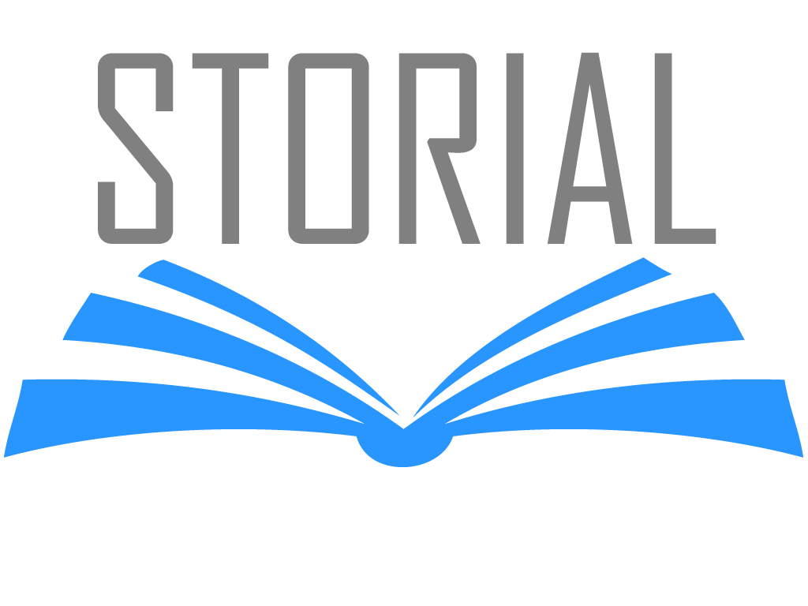

# Storial 2.0 -- MERN Stack
## Contents
  - [Tech Stack](#tech-stack)
  - [Getting Started - Setup](#getting-started)
  - [Contact Me](#contact-me)

## Tech Stack
React, Typescript, Redux Toolkit, TailwindCSS, Node, Express, MongoDB, React Testing Library

This is the original project.  Other directories in this repo will contain extensions of this project with stack variations.

### Getting Started
After cloning into your local directory, checkout "local-version" branch.  
> *Note: This branch is behind main in terms of versioning.  The main branch is the full app that [has been launched here](https://jamesespy.com/storial/) and has a richer feature set.  The local-version is meant allow folks to play with the code in their own environment and is a simpler version.*

Run npm install in both the client and server directories.  
Be sure you have [Mongo DB installed](https://docs.mongodb.com/manual/installation/) as well.

Once your dependencies are installed, you will need to open three terminals and enter the following commands:
  1. **MongoDB** 

  - Can execute from anywhere within the root directory:
    - ```brew services start mongodb-community```
    - ```mongo```
    - ```use books```

  2. **Server** - Navigate to ./client directory:  ```npm run start```
  
  3. **Client** 
    - Navigate to ./server directory: ```npm run start```

### Contact Me
Reach out, get to know me or check out more of my work:  [My Portfolio Site](https://github.com/jespy2/storial)